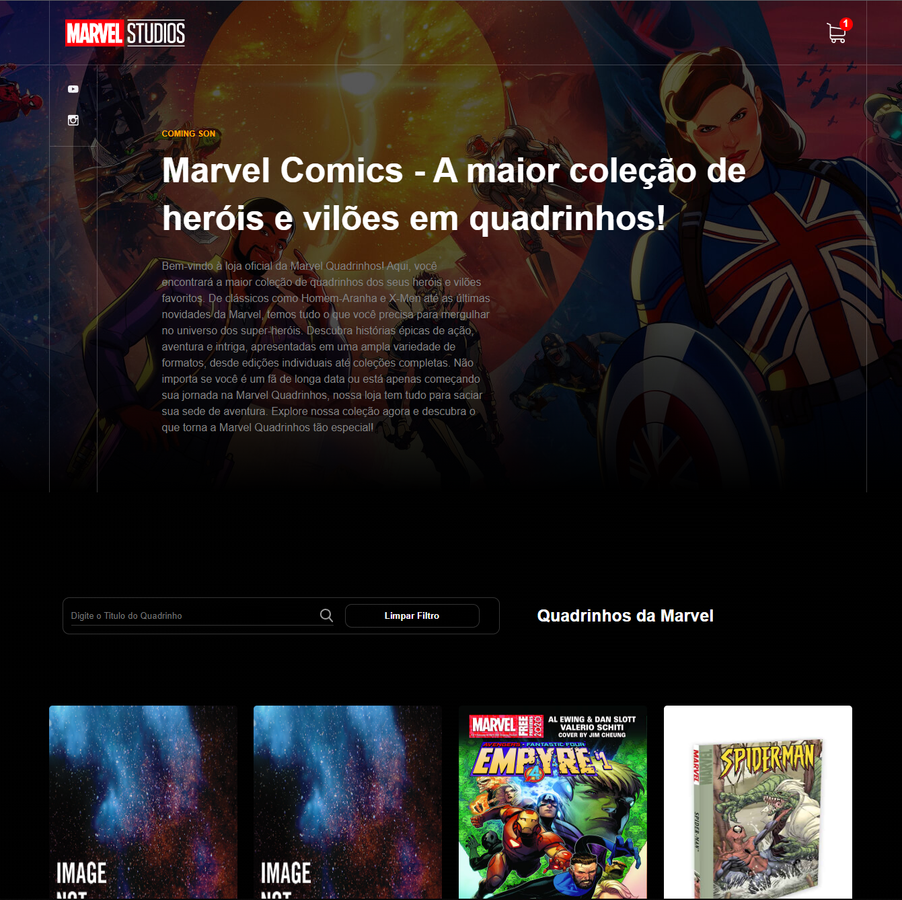

## Projeto final  Marvel Comics

 
 </img>

--- 

## 📋 Índice

- [Sobre](#projeto)
- [Tecnologias utilizadas](#-tecnologias-utilizadas)
- [Construído com](#%EF%B8%8F-construído-com)

--- 

## 🚀 Tecnologias utilizadas

O projeto está desenvolvido utilizando as seguintes tecnologias:

- React
- Style Components

--- 

## SOBRE 

Como foi desenvolvido
Para a criação deste website, seguimos os seguintes passos:

1- Planejamento: realizamos uma pesquisa de referências de websites de lojas virtuais de quadrinhos para termos uma ideia geral do que já havia no mercado. A partir disso, definimos o layout, a arquitetura e as funcionalidades que seriam desenvolvidas.

2 -Desenvolvimento da listagem de HQs: criamos uma página para listar todas as HQs disponíveis, utilizando paginação para melhorar a experiência do usuário. Além disso, escolhemos aleatoriamente 10% das HQs para marcar como "raras", e utilizamos um indicador visual para destacá-las.

3- Desenvolvimento da página de visualização individual: criamos uma página para exibir todas as informações de uma HQ selecionada, como título, descrição, preço e imagens.

4- Desenvolvimento do carrinho de compras: criamos uma página para o usuário visualizar o carrinho de compras e fazer a finalização da compra. Implementamos a possibilidade de inserir cupons de desconto, com validação mock, sem utilização de API.

## 🛠️ Construído com

* [Visual Studio Code](https://code.visualstudio.com/) - ferramenta de desenvolvimento

--- 

## 🛠️ Projeto no ar

* [Vercel](https://neo-app-marvel-git-master-mariolucas0.vercel.app/)
 
## 🎁 Expressões de gratidão

* Conte a outras pessoas sobre este projeto 📢
* Obrigado por ver esse projeto ❤️

## 🎁 CUPONS DO PROJETO

- CUPOM10 - COMUM
- RARO50 - RARO
--- 

## Limitações do projeto

- Infelizmente, não foi possível realizar todos os testes de fluxo na aplicação devido à minha falta de conhecimento técnico utilizando o Cypress. No entanto, agradeço sinceramente pela oportunidade 